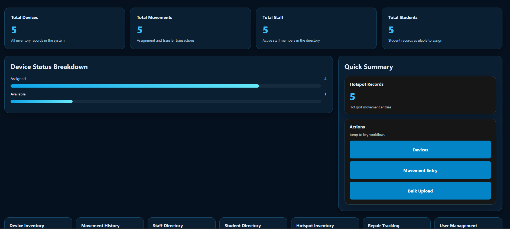

# Asset Command Center

Asset Command Center is an IT asset management application I independently designed and developed using Flask and PostgreSQL. I built the project to create a more organized way to track technology assets, assignments, movements, users, and operational information in one system.

This repository is a sanitized portfolio version of the project. It contains only fake demonstration data and does not include company records, employee information, student information, passwords, or confidential material.

## Purpose

I developed Asset Command Center after seeing how difficult it can be to manage equipment through separate spreadsheets and disconnected records. My goal was to build a working application that could centralize asset information, improve accountability, and make common inventory tasks easier to complete.

The project combines my experience in IT asset management, inventory control, fulfillment, logistics, data management, and process improvement.

## Main Features

- Secure user login and session management
- Admin and editor access levels
- Dashboard with live inventory totals and device status information
- Device inventory tracking
- Assignment and movement history
- Staff and student record management
- Hotspot inventory management
- Repair and depreciation tracking
- Searchable inventory tables
- Add and edit workflows
- CSV bulk-upload support
- User account management
- Password hashing and password-change functionality
- Environment-variable configuration for database credentials and application secrets

## Technology Used

- Python
- Flask
- Flask-Login
- PostgreSQL
- psycopg2
- HTML and CSS
- Microsoft Excel and CSV processing
- openpyxl
- xlrd

## Application Screenshot




## Project Structure

```text
asset-command-center/
├── app.py
├── requirements.txt
└── Image/
    ├── asset-command-center-login.png
    └── Dashboard.png
```

## Environment Variables

The application uses the following environment variables:

- ITAM_SECRET_KEY
- ITAM_DB_HOST
- ITAM_DB_PORT
- ITAM_DB_NAME
- ITAM_DB_USER
- ITAM_DB_PASSWORD
- SESSION_COOKIE_SECURE

## Copyright

Copyright © 2026 Ryann Leonard. All rights reserved.

This project is provided for portfolio review only. No permission is granted to copy, modify, distribute, sell, or reuse the source code without written authorization.
